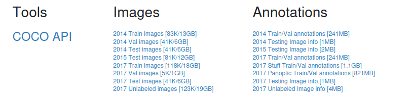
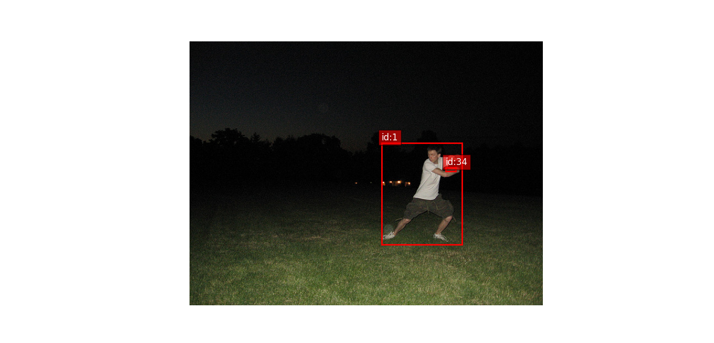
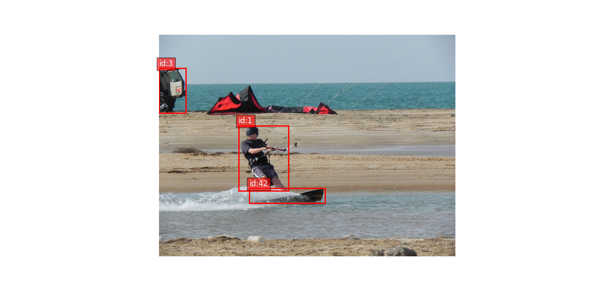
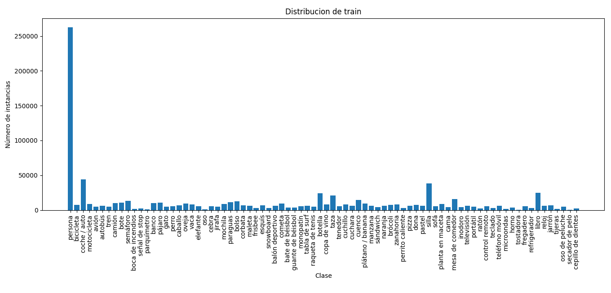
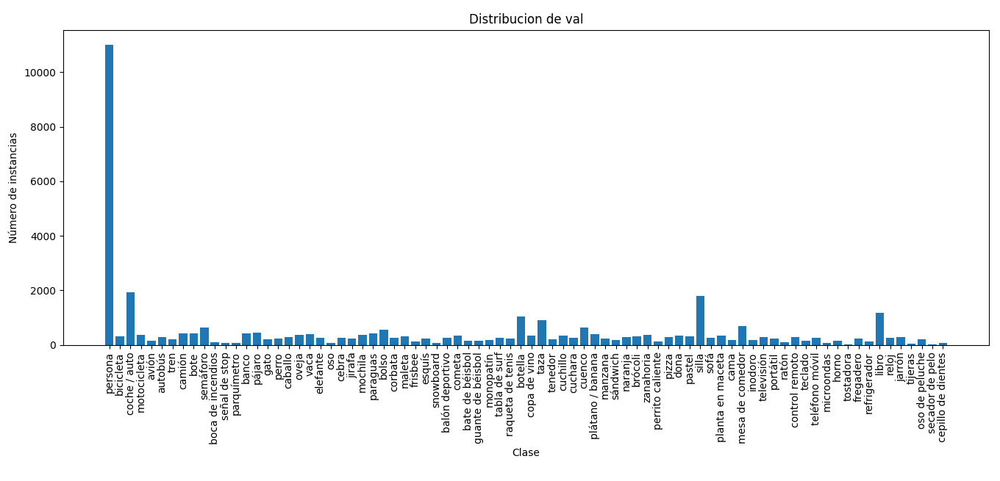
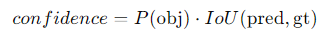

# YOLO-COCO


El objetivo de este proyecto es poner en practica la arquitectura de red neuronal YOLO para deteccion de objetos dentro de imagenes.

En este proyecto se implementara la arquitectura desde 0 utilizando el dataset COCO.


#   Informacion del dataset

Para descargar el dataset, se accedio a la  y se descargaron los siguientes archivos:




```
2017 Train images [118K/18GB]
2017 Val images [5K/1GB]
2017 Train/Val annotations [241 MB]
```

Se creo la clase `YOLODataset` para wrappear el dataset.

```python

from torch.utils.data import Dataset
from utils.encode_yolo_targets import encode_yolo_target
from utils.utils import get_image_id
from PIL import Image
from utils.utils import get_image_target
from utils.MACROS import *

class YOLODataset(Dataset):
    def __init__(self, X, Y, transformer) -> None:
        super().__init__()
        self.X = X # paths list
        self.Y = Y # target wrapper
        self.transformer = transformer

    def __getitem__(self, idx) :
        """
            Recordar que las imagenes tienen unos ids (que se encuentra en su nombre)
            Mientras que los targets tienen otro id
        """
        image = Image.open(self.X[idx]).convert('RGB') 
        image_tensor = self.transformer(image)
        image.close()
        image_annotation = get_image_target(get_image_id(self.X[idx]), self.Y)
        return image_tensor, encode_yolo_target(image_annotation, IMG_SIZE[0], IMG_SIZE[1], 80, 90)

    def __len__(self):
        return len(self.X)
```

Distribucion de ejemplos dispuestos:

```
Cantidad de elementos de train: 118287
Cantidad de elementos de val: 5000
```

# Resolucion de las imagenes

Utilizando el siguiente codigo:

```python
    w = []
    h = []
    for p in listdir("./dataset/train2017/"):
        complete_path = "./dataset/train2017/" + p
        image = Image.open(complete_path)
        w.append(image.size[0])
        h.append(image.size[1])
    for p in listdir("./dataset/val2017/"):
        complete_path = "./dataset/val2017/" + p
        image = Image.open(complete_path)
        w.append(image.size[0])
        h.append(image.size[1])
    print(min(w), max(w))
    print(min(h), max(h))
```

Se obtuvo el siguiente resultado:

```
Ancho minimo : 59
Ancho maximo : 640
Altura minima : 51 
Altura maxima : 640
```

# Normalizacion y estandarizacion

Despues de investigar, revisamos que en YOLO no suelen estandarizarse las imagenes, sin embargo, si se suelen normalizar, trabajo que ya hace `transforms.ToTensor()`

# Revision de targets

Despues de crear la clase `YOLODataset` ya obtuvimos acceso a generar tuplas `(image-tensor, target)` donde el target seria informacion relacionada con las bbox de las imagenes. Luego cree una funcion utilizada para, dada una imagen y dada sus annotations, renderizar la imagen + bboxes:


Teniendo en cuenta la siguiente lista de labels:

| ID | Nombre (Inglés) | Traducción (Español) |
|:--:|:----------------|:---------------------|
| 1  | person          | persona              |
| 2  | bicycle         | bicicleta            |
| 3  | car             | coche / auto         |
| 4  | motorcycle      | motocicleta          |
| 5  | airplane        | avión                |
| 6  | bus             | autobús              |
| 7  | train           | tren                 |
| 8  | truck           | camión               |
| 9  | boat            | bote                 |
| 10 | traffic light   | semáforo             |
| 11 | fire hydrant    | boca de incendios    |
| 13 | stop sign       | señal de stop        |
| 14 | parking meter   | parquímetro          |
| 15 | bench           | banco                |
| 16 | bird            | pájaro               |
| 17 | cat             | gato                 |
| 18 | dog             | perro                |
| 19 | horse           | caballo              |
| 20 | sheep           | oveja                |
| 21 | cow             | vaca                 |
| 22 | elephant        | elefante             |
| 23 | bear            | oso                  |
| 24 | zebra           | cebra                |
| 25 | giraffe         | jirafa               |
| 27 | backpack        | mochila              |
| 28 | umbrella        | paraguas             |
| 31 | handbag         | bolso                |
| 32 | tie             | corbata              |
| 33 | suitcase        | maleta               |
| 34 | frisbee         | frisbee              |
| 35 | skis            | esquís               |
| 36 | snowboard       | snowboard            |
| 37 | sports ball     | balón deportivo      |
| 38 | kite            | cometa               |
| 39 | baseball bat    | bate de béisbol      |
| 40 | baseball glove  | guante de béisbol    |
| 41 | skateboard      | monopatín            |
| 42 | surfboard       | tabla de surf        |
| 43 | tennis racket   | raqueta de tenis     |
| 44 | bottle          | botella              |
| 46 | wine glass      | copa de vino         |
| 47 | cup             | taza                 |
| 48 | fork            | tenedor              |
| 49 | knife           | cuchillo             |
| 50 | spoon           | cuchara              |
| 51 | bowl            | cuenco               |
| 52 | banana          | plátano / banana     |
| 53 | apple           | manzana              |
| 54 | sandwich        | sándwich             |
| 55 | orange          | naranja              |
| 56 | broccoli        | brócoli              |
| 57 | carrot          | zanahoria            |
| 58 | hot dog         | perrito caliente     |
| 59 | pizza           | pizza                |
| 60 | donut           | dona                 |
| 61 | cake            | pastel               |
| 62 | chair           | silla                |
| 63 | couch           | sofá                 |
| 64 | potted plant    | planta en maceta     |
| 65 | bed             | cama                 |
| 67 | dining table    | mesa de comedor      |
| 70 | toilet          | inodoro              |
| 72 | tv              | televisión           |
| 73 | laptop          | portátil             |
| 74 | mouse           | ratón                |
| 75 | remote          | control remoto       |
| 76 | keyboard        | teclado              |
| 77 | cell phone      | teléfono móvil       |
| 78 | microwave       | microondas           |
| 79 | oven            | horno                |
| 80 | toaster         | tostadora            |
| 81 | sink            | fregadero            |
| 82 | refrigerator    | refrigerador         |
| 84 | book            | libro                |
| 85 | clock           | reloj                |
| 86 | vase            | jarrón               |
| 87 | scissors        | tijeras              |
| 88 | teddy bear      | oso de peluche       |
| 89 | hair drier      | secador de pelo      |
| 90 | toothbrush      | cepillo de dientes   |


```python

# utils/render_yolo_image.py


import torch
from torchvision import transforms

def render_yolo_image(image_tensor, target):
    """
    image_tensor: Tensor [3, H, W] en rango [0,1]
    target: lista de dicts en formato COCO (annotations)
    """

    # Pasar tensor a formato HWC para matplotlib
    img = image_tensor.permute(1, 2, 0).numpy()

    fig, ax = plt.subplots(1, figsize=(10, 10))
    ax.imshow(img)

    for ann in target:
        # Formato COCO: [x_min, y_min, width, height]
        x, y, w, h = ann["bbox"]

        # Crear rectángulo
        rect = patches.Rectangle(
            (x, y), w, h,
            linewidth=2,
            edgecolor="red",
            facecolor="none"
        )

        ax.add_patch(rect)

        # Etiqueta de clase
        class_id = ann["category_id"]
        ax.text(
            x, y - 5,
            f"id:{class_id}",
            color="white",
            fontsize=12,
            bbox=dict(facecolor="red", alpha=0.6)
        )

    ax.axis("off")
    plt.show()

```

Logrando este tipo de resultados:




# Distribucion de apariciones de clases

Utilizando la siguiente funcion:


```python

# utils/utils.py

def get_dataset_classes_count(paths, target_wrapper):
    """
        Dado una lista de paths de imagenes
        muestra informacion acerca de la distribucion
        de sus targets
    """
    # esta version de coco contiene 90 clases
    train_class_dist = [0 for i in range(91)]
    for path in paths:
        image_ann = get_image_target(get_image_id(path), target_wrapper)
        for bbox in image_ann:
            cat = int(bbox["category_id"])
            train_class_dist[cat] +=1
    return train_class_dist


```

```python

# utils/utils.py

def plot_class_distribution(class_counts, class_names=None, title="Distribución de Clases"):
    """
    class_counts : list o np.array
        Conteo de apariciones por clase (indexado por class_id).
    
    class_names : list o None
        Nombres de las clases en el mismo orden que class_counts.
        Si es None, se usan los índices como etiquetas.
    
    title : str
        Título del gráfico.
    """

    class_counts = np.array(class_counts)

    # Filtrar solo clases con apariciones > 0
    valid_idx = np.where(class_counts > 0)[0]
    valid_counts = class_counts[valid_idx]

    if class_names is not None:
        valid_labels = [class_names[i] for i in valid_idx]
    else:
        valid_labels = [str(i) for i in valid_idx]

    plt.figure(figsize=(14, 6))
    plt.bar(valid_labels, valid_counts)
    plt.title(title)
    plt.xlabel("Clase")
    plt.ylabel("Número de instancias")
    plt.xticks(rotation=90)
    plt.tight_layout()
    plt.show()

```

```python
# main.py

import enum
from matplotlib.pyplot import plot
from pycocotools.coco import COCO
from utils.utils import load_images_paths
from utils.MACROS import COCO_CLASSES_ES, TRAIN_ANN_FILE, VAL_ANN_FILE
from utils.utils import get_dataset_classes_count
from utils.utils import plot_class_distribution
from utils.utils import render_yolo_image
from utils.YOLODataset import YOLODataset


if __name__ == "__main__":

    Y_train_wrapper = COCO(TRAIN_ANN_FILE)
    X_train_paths = load_images_paths("./dataset/train2017/train2017/")
    train_dataset = YOLODataset(X_train_paths, Y_train_wrapper)

    Y_val_wrapper = COCO(VAL_ANN_FILE)
    X_val_paths = load_images_paths("./dataset/val2017/val2017/")

    
    train_classes_count = get_dataset_classes_count(X_train_paths, Y_train_wrapper)
    non_app = [x for x,y in enumerate(train_classes_count) if x!=0 and y == 0]
    print(f"Las clases que no aparecen en train son : {non_app}")
    plot_class_distribution(train_classes_count,COCO_CLASSES_ES, "Distribucion de train")


    val_classes_count = get_dataset_classes_count(X_val_paths, Y_val_wrapper)
    non_app = [x for x,y in enumerate(val_classes_count) if x!=0 and y == 0]
    print(f"Las clases que no aparecen en val son : {non_app}")
    plot_class_distribution(val_classes_count, COCO_CLASSES_ES, "Distribucion de val")
```

Se obtuvieron los siguientes resultados:




```

Las clases que no aparecen en train son : [12, 26, 29, 30, 45, 66, 68, 69, 71, 83]
Las clases que no aparecen en val son   : [12, 26, 29, 30, 45, 66, 68, 69, 71, 83]

```


# Entendiendo el formato de los targets

Las annotations tienen el siguiente formato:

```
{
  'segmentation': [...],   
  'area': 53481.5,        
  'iscrowd': 0,            
  'image_id': 42,          
  'bbox': [x, y, w, h],    
  'category_id': 18,      
  'id': 1817255
}
```

De los cuales, solo nos interesan los siguientes campos:

```
{
  'image_id': 42,           # ✅ útil para indexar
  'bbox': [x, y, w, h],     # ✅ FUNDAMENTAL
  'category_id': 18,        # ✅ FUNDAMENTAL
}
```

Es imporante tener en cuenta que los bbox contienen las coordenadas de las imagenes con valores absolutos a la imagen, y que llevan el siguiente formato:

```
bbox : [x_inicio, y_inicio, ancho, alto]
```

Por ejemplo, la ultima imagen mostrada, contiene el siguiente target:

```
[
{ image_id': 32129, 'bbox': [171.81, 196.61, 107.38, 140.67], 'category_id': 1}, 
{'image_id': 32129, 'bbox': [195.29, 332.36, 162.93, 31.61], 'category_id': 42}, 
{'image_id': 32129, 'bbox': [0.0, 72.5, 57.72, 96.8], 'category_id': 3}
]
```

Nota : se modifico el `get_image_target` para solo retornar los campos que requerimos ...

```python
from utils.MACROS import ANNOTATIONS_REQUIRED

def get_image_target(image_id, target_wrapper):
    """
        Retorna el target de la imagen a partir de su ID
    """
    ann_ids = target_wrapper.getAnnIds(imgIds=[image_id]) # se obtiene el id de la anotacion a partir de la imagen
    annotations = target_wrapper.loadAnns(ann_ids) # se obtienen las anotaciones
    return [{x:y for x,y in a.items() if x in ANNOTATIONS_REQUIRED} for a in annotations]
```


#   Arquitectura

En este ejercicio se compararan las siguientes arquitecturas.

| Versión           | Rol en tu estudio                        |
| ----------------- | ---------------------------------------- |
| **YOLOv1**        | El comienzo de todo                      |
| **YOLOv3**        | YOLO clásico, referencia teórica         |
| **YOLOv5**        | YOLO moderno con anchors, uso industrial |
| **YOLOv8 (o v9)** | YOLO de última generación, anchor-free   |

## YOLO v1

La primera version de YOLO se caracteriza por:

1. Los targets solo tienen una box como maximo (cada celda solo puede ser responsable de un objeto). Si dos objetos coinciden en la misma celda, nos quedamos con el mas grande.
2. El modelo produce dos bbox.
3. De las dos bbox solo uno sera responsable de predecir el objeto de la celda.
4. NMS en inferencia.
5. La confianza sigue la siguiente formula:



6. Parámetros de la caja: (x,y) relativos a la celda; (w,h) relativos a la imagen
7. Función de pérdida con pesos distintos

La loss de YOLOv1 combina:

* error de localización

* error de confianza (objeto vs no objeto)

* error de clasificación

* sqrt(w), sqrt(h) en la loss para que errores en cajas grandes no dominen tanto y para estabilizar.

8. Clasificación por celda: una sola distribución de clases por celda

En YOLOv1 las clases son por celda, no por bbox.
Es decir, la celda produce la probabilidad por clase una vez, y luego se combina con la confianza de cada bbox.
Esto es una limitación típica cuando hay objetos distintos muy cerca o en la misma celda.


## YOLO v1 : produccion de targets.

Utilizando la siguiente funcion, logramos producir un tensor a partir de las annotations de las imagenes:

```python


def encode_yolo_target(
    annotations,
    image_width,
    image_height,
    grid_size,
    num_classes,
):
    """
    Convierte anotaciones COCO de UNA imagen a un tensor target tipo YOLO.

    Parameters
    ----------
    annotations : list[dict]
        Lista de anotaciones de una imagen en formato COCO.
        Cada dict debe tener, al menos:
            - "bbox": [x, y, w, h] en píxeles (formato COCO, esquina sup. izq.)
            - "category_id": id de clase (COCO)
    image_width : int
        Ancho de la imagen (en píxeles).
    image_height : int
        Alto de la imagen (en píxeles).
    grid_size : int
        Tamaño S de la grilla (S x S).
    num_classes : int
        Número de clases del dataset.

    Returns
    -------
    target : torch.Tensor
        Tensor [S, S, 5 + num_classes] con:
            target[..., 0:4] = [tx, ty, tw, th]
            target[..., 4]   = confidence (0 o 1)
            target[..., 5:]  = one-hot de clases
    """

    S = grid_size
    C = num_classes

    # [S, S, 5 + C]
    target = torch.zeros((S, S, 5 + C), dtype=torch.float32)

    cell_w = image_width / S
    cell_h = image_height / S

    for ann in annotations:
        bbox = ann["bbox"]     # [x, y, w, h] en píxeles
        x, y, w, h = bbox

        # Centro del bbox en píxeles
        x_c = x + w / 2.0
        y_c = y + h / 2.0

        # Índice de la celda donde cae el centro
        i = int(x_c / cell_w)  # columna (eje x)
        j = int(y_c / cell_h)  # fila (eje y)

        # Ignorar cajas fuera de la imagen o justo en el borde extremo
        if i < 0 or i >= S or j < 0 or j >= S:
            continue

        # Coordenadas relativas a la celda (entre 0 y 1)
        x_cell = x_c / cell_w
        y_cell = y_c / cell_h
        tx = x_cell - i
        ty = y_cell - j

        # Ancho y alto normalizados al tamaño completo de la imagen
        tw = w / image_width
        th = h / image_height

        # Si la celda ya tiene un objeto, podemos decidir si reemplazarlo
        # por el más grande (en área) para no perder información.
        if target[j, i, 4] == 1:
            # Ya hay objeto → comparamos áreas
            prev_tw = target[j, i, 2] * image_width
            prev_th = target[j, i, 3] * image_height
            prev_area = prev_tw * prev_th
            new_area = w * h

            # Si el que ya está es más grande, nos lo quedamos
            if prev_area >= new_area:
                continue

        # Guardamos bbox normalizado y confianza
        target[j, i, 0] = tx
        target[j, i, 1] = ty
        target[j, i, 2] = tw
        target[j, i, 3] = th
        target[j, i, 4] = 1.0

        # One-hot de clase (asumiendo COCO: category_id ~ [1..num_classes])
        cat_id = ann["category_id"]
        class_idx = cat_id - 1  # si tus clases van de 1 a C

        if 0 <= class_idx < C:
            target[j, i, 5 + class_idx] = 1.0

    return target
```


#   Evaluacion

