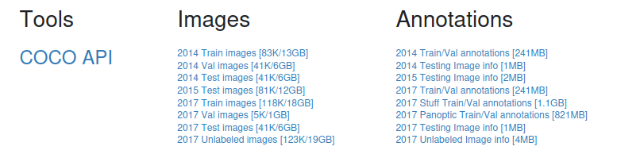
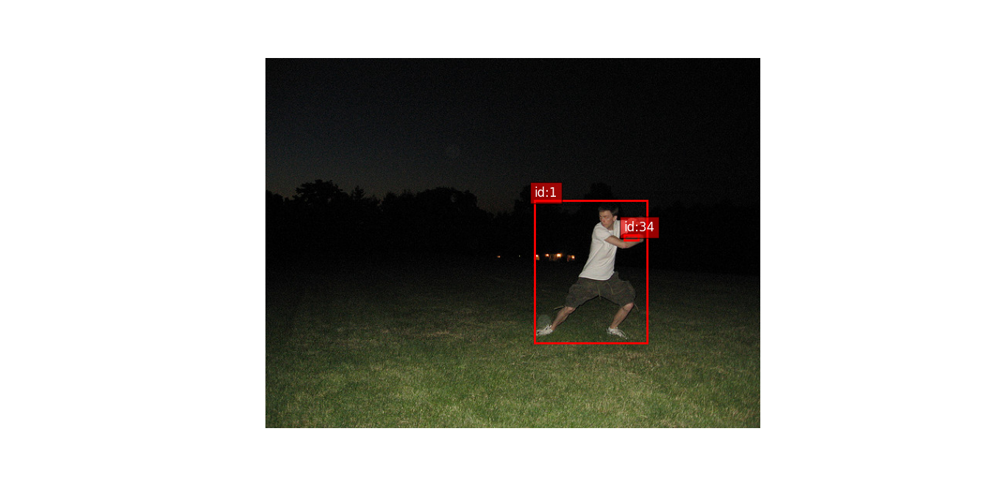
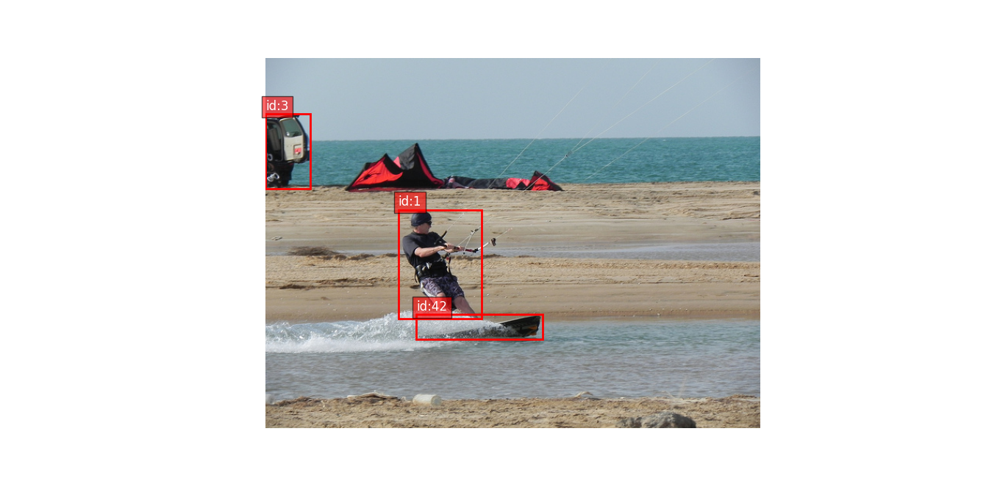
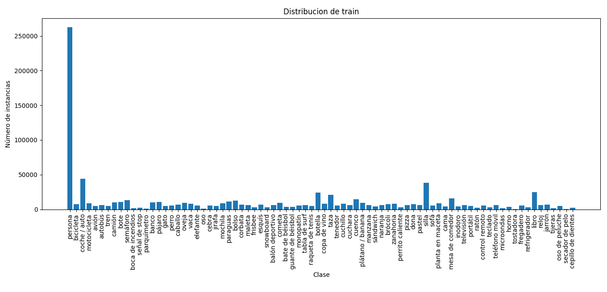
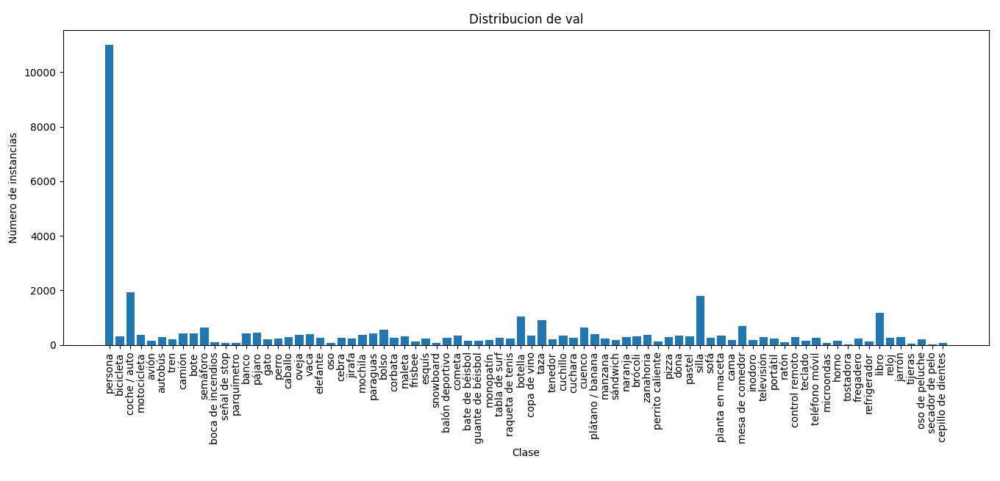

# YOLO-COCO


El objetivo de este proyecto es poner en práctica la arquitectura de red neuronal YOLO para detección de objetos dentro de imágenes.

En este proyecto se implementará la arquitectura desde 0 utilizando el dataset COCO.


#   Información del dataset

Para descargar el dataset, se accedió a la [página oficial de coco](https://cocodataset.org/#download) y se descargaron los siguientes archivos:





```
2017 Train images [118K/18GB]
2017 Val images [5K/1GB]
2017 Train/Val annotations [241 MB]
```

Se creó la clase `YOLODataset` para wrappear el dataset.

```python

from torch.utils.data import Dataset
from utils.encode_yolo_targets import encode_yolo_target
from utils.utils import get_image_id
from PIL import Image
from utils.utils import get_image_target
from utils.MACROS import *

class YOLODataset(Dataset):
    def __init__(self, X, Y, transformer) -> None:
        super().__init__()
        self.X = X # paths list
        self.Y = Y # target wrapper
        self.transformer = transformer

    def __getitem__(self, idx) :
        """
            Recordar que las imágenes tienen unos ids (que se encuentra en su nombre)
            Mientras que los targets tienen otro id
        """
        image = Image.open(self.X[idx]).convert('RGB') 
        image_tensor = self.transformer(image)
        image.close()
        image_annotation = get_image_target(get_image_id(self.X[idx]), self.Y)
        return image_tensor, encode_yolo_target(image_annotation, IMG_SIZE[0], IMG_SIZE[1], 80, 90)

    def __len__(self):
        return len(self.X)
```

Distribución de ejemplos dispuestos:

```
Cantidad de elementos de train: 118287
Cantidad de elementos de val: 5000
```

# Resolución de las imágenes

Utilizando el siguiente código:

```python
    w = []
    h = []
    for p in listdir("./dataset/train2017/"):
        complete_path = "./dataset/train2017/" + p
        image = Image.open(complete_path)
        w.append(image.size[0])
        h.append(image.size[1])
    for p in listdir("./dataset/val2017/"):
        complete_path = "./dataset/val2017/" + p
        image = Image.open(complete_path)
        w.append(image.size[0])
        h.append(image.size[1])
    print(min(w), max(w))
    print(min(h), max(h))
```

Se obtuvo el siguiente resultado:

```
Ancho mínimo : 59
Ancho máximo : 640
Altura mínima : 51 
Altura máxima : 640
```

# Normalización y estandarización

Después de investigar, revisamos que en YOLO no suelen estandarizarse las imágenes, sin embargo, sí se suelen normalizar, trabajo que ya hace `transforms.ToTensor()`

# Revisión de targets

Después de crear la clase `YOLODataset` ya obtuvimos acceso a generar tuplas `(image-tensor, target)` donde el target sería información relacionada con las bbox de las imágenes. Luego creé una función utilizada para, dada una imagen y dada sus annotations, renderizar la imagen + bboxes:


Teniendo en cuenta la siguiente lista de labels:

| ID | Nombre (Inglés) | Traducción (Español) |
|:--:|:----------------|:---------------------|
| 1  | person          | persona              |
| 2  | bicycle         | bicicleta            |
| 3  | car             | coche / auto         |
| 4  | motorcycle      | motocicleta          |
| 5  | airplane        | avión                |
| 6  | bus             | autobús              |
| 7  | train           | tren                 |
| 8  | truck           | camión               |
| 9  | boat            | bote                 |
| 10 | traffic light   | semáforo             |
| 11 | fire hydrant    | boca de incendios    |
| 13 | stop sign       | señal de stop        |
| 14 | parking meter   | parquímetro          |
| 15 | bench           | banco                |
| 16 | bird            | pájaro               |
| 17 | cat             | gato                 |
| 18 | dog             | perro                |
| 19 | horse           | caballo              |
| 20 | sheep           | oveja                |
| 21 | cow             | vaca                 |
| 22 | elephant        | elefante             |
| 23 | bear            | oso                  |
| 24 | zebra           | cebra                |
| 25 | giraffe         | jirafa               |
| 27 | backpack        | mochila              |
| 28 | umbrella        | paraguas             |
| 31 | handbag         | bolso                |
| 32 | tie             | corbata              |
| 33 | suitcase        | maleta               |
| 34 | frisbee         | frisbee              |
| 35 | skis            | esquís               |
| 36 | snowboard       | snowboard            |
| 37 | sports ball     | balón deportivo      |
| 38 | kite            | cometa               |
| 39 | baseball bat    | bate de béisbol      |
| 40 | baseball glove  | guante de béisbol    |
| 41 | skateboard      | monopatín            |
| 42 | surfboard       | tabla de surf        |
| 43 | tennis racket   | raqueta de tenis     |
| 44 | bottle          | botella              |
| 46 | wine glass      | copa de vino         |
| 47 | cup             | taza                 |
| 48 | fork            | tenedor              |
| 49 | knife           | cuchillo             |
| 50 | spoon           | cuchara              |
| 51 | bowl            | cuenco               |
| 52 | banana          | plátano / banana     |
| 53 | apple           | manzana              |
| 54 | sandwich        | sándwich             |
| 55 | orange          | naranja              |
| 56 | broccoli        | brócoli              |
| 57 | carrot          | zanahoria            |
| 58 | hot dog         | perrito caliente     |
| 59 | pizza           | pizza                |
| 60 | donut           | dona                 |
| 61 | cake            | pastel               |
| 62 | chair           | silla                |
| 63 | couch           | sofá                 |
| 64 | potted plant    | planta en maceta     |
| 65 | bed             | cama                 |
| 67 | dining table    | mesa de comedor      |
| 70 | toilet          | inodoro              |
| 72 | tv              | televisión           |
| 73 | laptop          | portátil             |
| 74 | mouse           | ratón                |
| 75 | remote          | control remoto       |
| 76 | keyboard        | teclado              |
| 77 | cell phone      | teléfono móvil       |
| 78 | microwave       | microondas           |
| 79 | oven            | horno                |
| 80 | toaster         | tostadora            |
| 81 | sink            | fregadero            |
| 82 | refrigerator    | refrigerador         |
| 84 | book            | libro                |
| 85 | clock           | reloj                |
| 86 | vase            | jarrón               |
| 87 | scissors        | tijeras              |
| 88 | teddy bear      | oso de peluche       |
| 89 | hair drier      | secador de pelo      |
| 90 | toothbrush      | cepillo de dientes   |


```python

# utils/render_yolo_image.py


import torch
from torchvision import transforms

def render_yolo_image(image_tensor, target):
    """
    image_tensor: Tensor [3, H, W] en rango [0,1]
    target: lista de dicts en formato COCO (annotations)
    """

    # Pasar tensor a formato HWC para matplotlib
    img = image_tensor.permute(1, 2, 0).numpy()

    fig, ax = plt.subplots(1, figsize=(10, 10))
    ax.imshow(img)

    for ann in target:
        # Formato COCO: [x_min, y_min, width, height]
        x, y, w, h = ann["bbox"]

        # Crear rectángulo
        rect = patches.Rectangle(
            (x, y), w, h,
            linewidth=2,
            edgecolor="red",
            facecolor="none"
        )

        ax.add_patch(rect)

        # Etiqueta de clase
        class_id = ann["category_id"]
        ax.text(
            x, y - 5,
            f"id:{class_id}",
            color="white",
            fontsize=12,
            bbox=dict(facecolor="red", alpha=0.6)
        )

    ax.axis("off")
    plt.show()

```

Logrando este tipo de resultados:




# Distribución de apariciones de clases

Utilizando la siguiente función:


```python

# utils/utils.py

def get_dataset_classes_count(paths, target_wrapper):
    """
        Dado una lista de paths de imágenes
        muestra información acerca de la distribución
        de sus targets
    """
    # esta versión de coco contiene 90 clases
    train_class_dist = [0 for i in range(91)]
    for path in paths:
        image_ann = get_image_target(get_image_id(path), target_wrapper)
        for bbox in image_ann:
            cat = int(bbox["category_id"])
            train_class_dist[cat] +=1
    return train_class_dist


```

```python

# utils/utils.py

def plot_class_distribution(class_counts, class_names=None, title="Distribución de Clases"):
    """
    class_counts : list o np.array
        Conteo de apariciones por clase (indexado por class_id).
    
    class_names : list o None
        Nombres de las clases en el mismo orden que class_counts.
        Si es None, se usan los índices como etiquetas.
    
    title : str
        Título del gráfico.
    """

    class_counts = np.array(class_counts)

    # Filtrar solo clases con apariciones > 0
    valid_idx = np.where(class_counts > 0)[0]
    valid_counts = class_counts[valid_idx]

    if class_names is not None:
        valid_labels = [class_names[i] for i in valid_idx]
    else:
        valid_labels = [str(i) for i in valid_idx]

    plt.figure(figsize=(14, 6))
    plt.bar(valid_labels, valid_counts)
    plt.title(title)
    plt.xlabel("Clase")
    plt.ylabel("Número de instancias")
    plt.xticks(rotation=90)
    plt.tight_layout()
    plt.show()

```

```python
# main.py

import enum
from matplotlib.pyplot import plot
from pycocotools.coco import COCO
from utils.utils import load_images_paths
from utils.MACROS import COCO_CLASSES_ES, TRAIN_ANN_FILE, VAL_ANN_FILE
from utils.utils import get_dataset_classes_count
from utils.utils import plot_class_distribution
from utils.utils import render_yolo_image
from utils.YOLODataset import YOLODataset


if __name__ == "__main__":

    Y_train_wrapper = COCO(TRAIN_ANN_FILE)
    X_train_paths = load_images_paths("./dataset/train2017/train2017/")
    train_dataset = YOLODataset(X_train_paths, Y_train_wrapper)

    Y_val_wrapper = COCO(VAL_ANN_FILE)
    X_val_paths = load_images_paths("./dataset/val2017/val2017/")

    
    train_classes_count = get_dataset_classes_count(X_train_paths, Y_train_wrapper)
    non_app = [x for x,y in enumerate(train_classes_count) if x!=0 and y == 0]
    print(f"Las clases que no aparecen en train son : {non_app}")
    plot_class_distribution(train_classes_count,COCO_CLASSES_ES, "Distribución de train")


    val_classes_count = get_dataset_classes_count(X_val_paths, Y_val_wrapper)
    non_app = [x for x,y in enumerate(val_classes_count) if x!=0 and y == 0]
    print(f"Las clases que no aparecen en val son : {non_app}")
    plot_class_distribution(val_classes_count, COCO_CLASSES_ES, "Distribución de val")
```

Se obtuvieron los siguientes resultados:




```

Las clases que no aparecen en train son : [12, 26, 29, 30, 45, 66, 68, 69, 71, 83]
Las clases que no aparecen en val son   : [12, 26, 29, 30, 45, 66, 68, 69, 71, 83]

```


# Entendiendo el formato de los targets

Las annotations tienen el siguiente formato:

```
{
  'segmentation': [...],   
  'area': 53481.5,        
  'iscrowd': 0,            
  'image_id': 42,          
  'bbox': [x, y, w, h],    
  'category_id': 18,      
  'id': 1817255
}
```

De los cuales, solo nos interesan los siguientes campos:

```
{
  'image_id': 42,           # ✅ útil para indexar
  'bbox': [x, y, w, h],     # ✅ FUNDAMENTAL
  'category_id': 18,        # ✅ FUNDAMENTAL
}
```

Es importante tener en cuenta que los bbox contienen las coordenadas de las imágenes con valores absolutos a la imagen, y que llevan el siguiente formato:

```
bbox : [x_inicio, y_inicio, ancho, alto]
```

Por ejemplo, la última imagen mostrada, contiene el siguiente target:

```
[
{ image_id': 32129, 'bbox': [171.81, 196.61, 107.38, 140.67], 'category_id': 1}, 
{'image_id': 32129, 'bbox': [195.29, 332.36, 162.93, 31.61], 'category_id': 42}, 
{'image_id': 32129, 'bbox': [0.0, 72.5, 57.72, 96.8], 'category_id': 3}
]
```

Nota : se modificó el `get_image_target` para solo retornar los campos que requerimos ...

```python
from utils.MACROS import ANNOTATIONS_REQUIRED

def get_image_target(image_id, target_wrapper):
    """
        Retorna el target de la imagen a partir de su ID
    """
    ann_ids = target_wrapper.getAnnIds(imgIds=[image_id]) # se obtiene el id de la anotación a partir de la imagen
    annotations = target_wrapper.loadAnns(ann_ids) # se obtienen las anotaciones
    return [{x:y for x,y in a.items() if x in ANNOTATIONS_REQUIRED} for a in annotations]
```


#   Arquitectura

En este ejercicio se compararán las siguientes arquitecturas.

| Versión           | Rol en tu estudio                        |
| ----------------- | ---------------------------------------- |
| **YOLOv1**        | El comienzo de todo                      |
| **YOLOv3**        | YOLO clásico, referencia teórica         |
| **YOLOv5**        | YOLO moderno con anchors, uso industrial |
| **YOLOv8 (o v9)** | YOLO de última generación, anchor-free   |

## YOLO v1

La primera versión de YOLO se caracteriza por:

* Los targets solo tienen una box como máximo (cada celda solo puede ser responsable de un objeto). Si dos objetos coinciden en la misma celda, nos quedamos con el más grande.
* El modelo produce dos bbox.
* De las dos bbox solo uno será responsable de predecir el objeto de la celda, la que mayor IoU tenga.
* NMS en inferencia.
* La confianza sigue la siguiente fórmula:

$$
conf = P(obj) * IoU(pred, gt)
$$


* Parámetros de la caja: (x,y) relativos a la celda; (w,h) relativos a la imagen
* Función de pérdida con pesos distintos: La loss de YOLOv1 combina:

    * error de localización

    * error de confianza (objeto vs no objeto)

    * error de clasificación

    * sqrt(w), sqrt(h) en la loss para que errores en cajas grandes no dominen tanto y para estabilizar.

## YOLO v1 : producción de targets.

Utilizando la siguiente función, logramos producir un tensor a partir de las annotations de las imágenes. Este tensor tendrá solo una box por celda, como así lo indica el [paper](https://pjreddie.com/static/papers/yolo_1.pdf) de YOLO v1:

```python

from utils.utils import warning
import torch


def encode_yolov1(
    previus_img_size,
    annotations,
    img_size,
    grid_size,
    num_classes,
):
    """
    Convierte anotaciones COCO de UNA imagen a un tensor target tipo YOLO.

    Parameters
    ----------
    annotations : list[dict]
        Lista de anotaciones de una imagen en formato COCO.
        Cada dict debe tener, al menos:
            - "bbox": [x, y, w, h] en píxeles (formato COCO, esquina sup. izq.)
            - "category_id": id de clase (COCO)
    image_width : int
        Ancho de la imagen (en píxeles).
    image_height : int
        Alto de la imagen (en píxeles).
    grid_size : int
        Tamaño S de la grilla (S x S).
    num_classes : int
        Número de clases del dataset.

    Returns
    -------
    target : torch.Tensor
        Tensor [S, S, 5 + num_classes] con:
            target[..., 0:4] = [tx, ty, tw, th]
            target[..., 4]   = confidence (0 o 1)
            target[..., 5:]  = one-hot de clases
    """
    image_width = img_size[0]
    image_height = img_size[1]

    div_ratio_w = previus_img_size[0] / image_width
    div_ratio_h = previus_img_size[1] / image_height

    S = grid_size
    C = num_classes

    # [S, S, 5 + C]
    target = torch.zeros((S, S, 5 + C), dtype=torch.float32)

    cell_w = image_width / S
    cell_h = image_height / S
    ignored = 0

    for ann in annotations:
        bbox = ann["bbox"]     # [x, y, w, h] en píxeles
        x, y, w, h = bbox
        x /= div_ratio_w
        w /= div_ratio_w
        y /= div_ratio_h
        h /= div_ratio_h

        # Centro del bbox en píxeles
        x_c = x + w / 2.0
        y_c = y + h / 2.0


        # Índice de la celda donde cae el centro
        i = int(x_c / cell_w)  # columna (eje x)
        j = int(y_c / cell_h)  # fila (eje y)

        if i < 0 or i >= S or j < 0 or j >= S:
            ignored +=1
            continue

        # Coordenadas relativas a la celda (entre 0 y 1)
        x_cell = x_c / cell_w
        y_cell = y_c / cell_h
        tx = x_cell - i
        ty = y_cell - j

        # Ancho y alto normalizados al tamaño completo de la imagen
        tw = w / image_width
        th = h / image_height

        # Si la celda ya tiene un objeto, podemos decidir si reemplazarlo
        # por el más grande (en área) para no perder información.
        if target[j, i, 4] == 1:
            # Ya hay objeto → comparamos áreas
            prev_tw = target[j, i, 2] * image_width
            prev_th = target[j, i, 3] * image_height
            prev_area = prev_tw * prev_th
            new_area = w * h

            # Si el que ya está es más grande, nos lo quedamos
            if prev_area >= new_area:
                ignored += 1
                continue

        # Guardamos bbox normalizado y confianza
        target[j, i, 0] = tx
        target[j, i, 1] = ty
        target[j, i, 2] = tw
        target[j, i, 3] = th
        target[j, i, 4] = 1.0

        # One-hot de clase (asumiendo COCO: category_id ~ [1..num_classes])
        cat_id = ann["category_id"]
        class_idx = cat_id - 1  # si tus clases van de 1 a C

        if 0 <= class_idx < C:
            target[j, i, 5:] = 0.0
            target[j, i, 5 + class_idx] = 1.0

    return target, ignored
```

Es importante destacar que en la primera versión de la función anterior no se estaba recibiendo el parámetro `previus_img_size` ni se estaban ejecutando las siguientes líneas de código:

```python

        x /= div_ratio_w
        w /= div_ratio_w
        y /= div_ratio_h
        h /= div_ratio_h
```

Esto provocaba que los cálculos para determinar la celda en la cual caería cada box se vieran sesgados y erróneos, ya que no se ajustaban al nuevo size de las imágenes. Esto provocaba que la cantidad de boxes ignoradas fuera superior a ~15, con esas modificaciones está entre 1-2, donde todas las cajas ignoradas son aquellas que caen en la misma celda.


## YOLO v1 : producción de predicciones.

Para lograr que la red prediga tensores con el mismo formato que los targets, pero con dos anchors (para YOLO v1), se implementa el siguiente código:

```python

from torch import nn
from utils.MACROS import *
import torch
import torch.nn as nn
from utils.ConvBlock import ConvBlock


class YOLOV1Backbone(nn.Module):
    def __init__(self):
        super(YOLOV1Backbone, self).__init__()
        self.layers = nn.Sequential(
            ConvBlock(3, 32, kernel_size=3, stride=1, padding=1),
            nn.MaxPool2d(2, 2),
            ConvBlock(32, 64, kernel_size=3, stride=1, padding=1),
            nn.MaxPool2d(2, 2),
            ConvBlock(64, 128, kernel_size=3, stride=1, padding=1),
            nn.AdaptiveAvgPool2d(GRID_SIZE)
        )

    def forward(self, x):
        return self.layers(x)


class YOLOV1Head(nn.Module):
    def __init__(self, grid_size, num_classes, num_anchors):
        super(YOLOV1Head, self).__init__()
        self.grid_size = grid_size
        self.num_classes = num_classes
        self.num_anchors = num_anchors
        self.detector = nn.Conv2d(128, num_anchors * (5 + num_classes), kernel_size=1)

    def forward(self, x):
        return self.detector(x).permute(0, 2, 3, 1).contiguous()

class YOLOv1(nn.Module):
    def __init__(self):
        super(YOLOv1, self).__init__()
        self.backbone = YOLOV1Backbone()
        self.head = YOLOV1Head(GRID_SIZE, NUM_CLASSES, 2)

    def forward(self, x):
        features = self.backbone(x)
        predictions = self.head(features)
        return predictions

```

## YOLO v1: cálculo de error.

A continuación, se muestra la función de error utilizada explicando sus componentes más importantes:


```python
import torch
from utils.yolo_iou import yolo_iou


def _to_abs_xywh_from_cell(box_tx_ty_tw_th: torch.Tensor, S: int) -> torch.Tensor:
    """
    Convierte cajas en formato YOLOv1 "por celda" a formato absoluto normalizado a la imagen.

    ENTRADA (formato por celda):
      box_tx_ty_tw_th = [..., 4] donde cada caja es [tx, ty, tw, th]

      - tx, ty: coordenadas del centro RELATIVAS a la celda (rango típico 0..1)
               Ej: tx=0.3 significa “30% del ancho de la celda desde el borde izquierdo de la celda”.
      - tw, th: ancho/alto NORMALIZADOS respecto a la imagen completa (0..1).

    SALIDA (formato absoluto normalizado a la imagen):
      [..., 4] donde cada caja es [x_abs, y_abs, w_abs, h_abs]
      - x_abs, y_abs: centro normalizado en coordenadas de la imagen completa (0..1).
      - w_abs, h_abs: igual a tw, th (ya estaban normalizados a imagen).

    Soporta dos shapes comunes:
      - target_box: (B, S, S, 4)
      - pred_box:   (B, S, S, A, 4)   (A = cantidad de anchors por celda)
    """
    device = box_tx_ty_tw_th.device
    B = box_tx_ty_tw_th.shape[0]  # batch size

    # ------------------------------------------------------------
    # Creamos un "grid" con los índices de celda (i, j) por cada posición.
    # i recorre columnas (eje x) -> 0..S-1
    # j recorre filas    (eje y) -> 0..S-1
    #
    # gx y gy quedan del shape (B, S, S) para que podamos hacer:
    #   x_abs = (i + tx)/S
    #   y_abs = (j + ty)/S
    # ------------------------------------------------------------
    gx = torch.arange(S, device=device).view(1, 1, S).expand(B, S, S)  # (B,S,S) columnas
    gy = torch.arange(S, device=device).view(1, S, 1).expand(B, S, S)  # (B,S,S) filas

    # ------------------------------------------------------------
    # Si las cajas tienen dimensión de anchors (B,S,S,A,4), necesitamos
    # “alinear” gx, gy para que puedan broadcast con esa dimensión A.
    # Pasan a (B,S,S,1) y se broadcast a (B,S,S,A) automáticamente.
    # ------------------------------------------------------------
    if box_tx_ty_tw_th.ndim == 5:
        gx = gx.unsqueeze(3)  # (B,S,S,1)
        gy = gy.unsqueeze(3)  # (B,S,S,1)

    # ------------------------------------------------------------
    # Separación de componentes:
    # tx,ty (centro relativo a la celda)
    # tw,th (tamaño normalizado a imagen)
    # ------------------------------------------------------------
    tx = box_tx_ty_tw_th[..., 0]
    ty = box_tx_ty_tw_th[..., 1]
    tw = box_tx_ty_tw_th[..., 2]
    th = box_tx_ty_tw_th[..., 3]

    # ------------------------------------------------------------
    # Conversión EXACTA pedida:
    # - sumamos el índice de celda (i o j) al offset dentro de la celda (tx, ty)
    # - dividimos entre S para normalizar a la imagen completa.
    #
    # Ejemplo (S=7):
    #   si estamos en la celda i=3 y tx=0.5,
    #   x_abs = (3 + 0.5)/7 = 0.5 -> centro a mitad de la imagen (aprox).
    # ------------------------------------------------------------
    x_abs = (gx + tx) / S
    y_abs = (gy + ty) / S
    w_abs = tw
    h_abs = th

    # Reconstruimos el tensor [...,4] con el mismo orden
    return torch.stack((x_abs, y_abs, w_abs, h_abs), dim=-1)


def yolov1_loss(predictions, targets, num_classes, lambda_coord=5, lambda_noobj=0.5):
    """
    Loss estilo YOLOv1, donde:
      - Se predicen 2 "anchors" por celda.
      - Cada anchor predice: [x,y,w,h,conf, clases]
      - Las clases se predicen POR ANCHOR (por eso el last_dim es 2*(5+C) = 190 con C=90)

    Shapes esperados:
      predictions: (B, S, S, 2*(5+C))  -> 190 si C=90
        anchor1: [x,y,w,h, conf, class(0..C-1)]
        anchor2: [x,y,w,h, conf, class(0..C-1)]

      targets: (B, S, S, 5+C)
        [tx,ty,tw,th, tconf, onehot_classes...]

    Nota importante de consistencia:
      - El target guarda (tx,ty) relativo a celda, pero (tw,th) normalizado a imagen.
      - Para calcular IoU correctamente, convertimos a coordenadas ABS normalizadas
        con _to_abs_xywh_from_cell() antes de llamar a yolo_iou().
    """

    # ------------------------------------------------------------
    # Extraemos dimensiones:
    # B: batch
    # S: número de celdas por eje (grid SxS)
    # P: tamaño del vector por celda en predictions
    # ------------------------------------------------------------
    B, S, _, P = predictions.shape

    C = num_classes
    A = 2                       # anchors por celda
    stride = 5 + C              # tamaño por anchor: 4 box + 1 conf + C clases
    expected_P = A * stride     # 2*(5+C)

    # Validación defensiva: evita bugs silenciosos por mismatch en el head o en el dataset
    if P != expected_P:
        raise ValueError(
            f"Predictions last dim debe ser {expected_P} (= {A}*(5+{C})) pero llegó {P}."
        )
    if targets.shape[-1] != (5 + C):
        raise ValueError(
            f"Targets last dim debe ser {5+C} (= 5+{C}) pero llegó {targets.shape[-1]}."
        )

    p1 = predictions[..., 0:stride] # (BATCH_SIZE, GRID_SIZE, GRID_SIZE, 95) -> bloque de los primeros anchors
    p2 = predictions[..., stride:2 * stride]# (BATCH_SIZE, GRID_SIZE, GRID_SIZE, 95) -> bloque de los segundos anchors

    # Anchor 1
    pred_box1 = p1[..., 0:4]          # (B,S,S,4) -> [tx,ty,tw,th] en tu espacio de predicción
    pred_conf1 = p1[..., 4]           # (B,S,S)
    pred_cls1 = p1[..., 5:5 + C]      # (B,S,S,C)

    # Anchor 2
    pred_box2 = p2[..., 0:4]
    pred_conf2 = p2[..., 4]
    pred_cls2 = p2[..., 5:5 + C]

    # ------------------------------------------------------------
    # Targets:
    # target_box: (B,S,S,4) -> [tx,ty,tw,th]
    # target_conf: (B,S,S) -> 1 si hay objeto asignado a esa celda, 0 si no
    # target_cls: (B,S,S,C) -> one-hot
    # ------------------------------------------------------------
    target_box = targets[..., 0:4]
    target_conf = targets[..., 4]
    target_cls = targets[..., 5:5 + C]

    # Máscaras booleanas:
    # obj_mask: celdas con objeto
    # noobj_mask: celdas sin objeto
    obj_mask = target_conf > 0
    noobj_mask = ~obj_mask

    # ------------------------------------------------------------
    # IoU consistente:
    # Convertimos pred y target a [x_abs,y_abs,w_abs,h_abs] en (0..1) respecto a la imagen.
    # Así el IoU no mezcla escalas de celda vs imagen (bug común).
    # ------------------------------------------------------------
    pred_abs1 = _to_abs_xywh_from_cell(pred_box1, S)     # (B,S,S,4)
    pred_abs2 = _to_abs_xywh_from_cell(pred_box2, S)     # (B,S,S,4)
    targ_abs = _to_abs_xywh_from_cell(target_box, S)     # (B,S,S,4)

    # IoU por celda (solo mide geometría, no conf ni clase)
    iou1 = yolo_iou(pred_abs1, targ_abs)  # (B,S,S)
    iou2 = yolo_iou(pred_abs2, targ_abs)  # (B,S,S)

    # Para cada celda, decidimos qué anchor explica mejor el target (mayor IoU)
    best_is_2 = iou2 > iou1  # (B,S,S) True => anchor2 es el responsable

    # ------------------------------------------------------------
    # Elegimos, por celda, cuál anchor es el responsable:
    # - resp_box / resp_conf / resp_cls => del anchor ganador
    # - nonresp_conf => del anchor perdedor (para penalizarlo en celdas con objeto)
    # ------------------------------------------------------------
    best_is_2_exp = best_is_2.unsqueeze(-1)  # (B,S,S,1) para poder hacer where en tensores [...,4] o [...,C]

    resp_box = torch.where(best_is_2_exp, pred_box2, pred_box1)   # (B,S,S,4)
    resp_conf = torch.where(best_is_2, pred_conf2, pred_conf1)    # (B,S,S)
    resp_cls = torch.where(best_is_2_exp, pred_cls2, pred_cls1)   # (B,S,S,C)

    nonresp_conf = torch.where(best_is_2, pred_conf1, pred_conf2) # (B,S,S)

    # ------------------------------------------------------------
    # COMPONENTES DE LA LOSS
    #
    # 1) Box regression:
    #    Se calcula SOLO donde hay objeto (obj_mask).
    #    Compara en el “espacio de entrenamiento” [tx,ty,tw,th],
    #    o sea, el mismo formato del target.
    # ------------------------------------------------------------
    box_loss = lambda_coord * torch.sum(((resp_box - target_box) ** 2)[obj_mask])

    # ------------------------------------------------------------
    # 2) Confidence:
    #    - obj_loss: el anchor responsable debe predecir conf ~ 1 (target_conf=1)
    #    - noobj_loss: penaliza conf alto en:
    #        a) celdas sin objeto (ambos anchors)
    #        b) el anchor NO responsable en celdas con objeto (debe “callarse”)
    # ------------------------------------------------------------
    obj_loss = torch.sum((resp_conf[obj_mask] - target_conf[obj_mask]) ** 2)

    noobj_loss = lambda_noobj * (
        torch.sum((pred_conf1[noobj_mask]) ** 2) +
        torch.sum((pred_conf2[noobj_mask]) ** 2) +
        torch.sum((nonresp_conf[obj_mask]) ** 2)
    )

    # ------------------------------------------------------------
    # 3) Classification:
    #    SOLO donde hay objeto.
    #    Como tu modelo predice clases por anchor (y no una sola vez por celda),
    #    usamos las clases del anchor responsable.
    # ------------------------------------------------------------
    class_loss = torch.sum(((resp_cls - target_cls) ** 2)[obj_mask])

    # Suma total
    return box_loss + obj_loss + noobj_loss + class_loss
```

## Separación de componentes (función de perdida, yolov1)

En esta parte, primero se separa el tensor de predicción en dos : una parte para los anchor1 (p1) y otra para los anchor2 (p2).

Luego, para cada uno de los tensores generados anteriormente (p1 y p2) se separan sus componentes (confianza, clases y boxes). Luego se hace lo mismo para el tensor target.


```python

    p1 = predictions[..., 0:stride] # (BATCH_SIZE, GRID_SIZE, GRID_SIZE, 95) -> bloque de los primeros anchors
    p2 = predictions[..., stride:2 * stride]# (BATCH_SIZE, GRID_SIZE, GRID_SIZE, 95) -> bloque de los segundos anchors

    # Anchor 1
    pred_box1 = p1[..., 0:4]          # (B,S,S,4) -> [tx,ty,tw,th] en tu espacio de predicción
    pred_conf1 = p1[..., 4]           # (B,S,S)
    pred_cls1 = p1[..., 5:5 + C]      # (B,S,S,C)

    # Anchor 2
    pred_box2 = p2[..., 0:4]
    pred_conf2 = p2[..., 4]
    pred_cls2 = p2[..., 5:5 + C]


    target_box = targets[..., 0:4]
    target_conf = targets[..., 4]
    target_cls = targets[..., 5:5 + C]

```

## Conversión de escalas de boxes (función de perdida, yolov1)

En esta parte, convertimos la escala de las boxes, asegurándonos de que todas estén en valores relativos a la imagen y no a la celda.

```python

    pred_abs1 = _to_abs_xywh_from_cell(pred_box1, S)     # (B,S,S,4)
    pred_abs2 = _to_abs_xywh_from_cell(pred_box2, S)     # (B,S,S,4)
    targ_abs = _to_abs_xywh_from_cell(target_box, S)     # (B,S,S,4)


```

## Uso de IoU para asignación (función de perdida, yolov1)

Usamos IoU para generar una matriz que dictará cual de los dos anchors será responsable para cada celda:

```python

    iou1 = yolo_iou(pred_abs1, targ_abs)  # (B,S,S)
    iou2 = yolo_iou(pred_abs2, targ_abs)  # (B,S,S)

    # Para cada celda, decidimos qué anchor explica mejor el target (mayor IoU)
    best_is_2 = iou2 > iou1  # (B,S,S) True => anchor2 es el responsable


```

La matriz `best_is_2` es una matriz de `GRID_SIZExGRID_SIZE` que tendrá `True` en las celdas correspondientes a aquellas en donde el anchor2 deba ser responsable, y False cuando el 1 deba ser responsable.

## Generación de tensor de predicción final (función de perdida, yolov1)

En el siguiente código se genera la matriz de predicción final con los anchors responsables.

```python

    resp_box = torch.where(best_is_2_exp, pred_box2, pred_box1)   # (b,s,s,4)
    resp_conf = torch.where(best_is_2, pred_conf2, pred_conf1)    # (b,s,s)
    resp_cls = torch.where(best_is_2_exp, pred_cls2, pred_cls1)   # (b,s,s,c)

    nonresp_conf = torch.where(best_is_2, pred_conf1, pred_conf2) # (B,S,S)
```

Para cada celda donde `best_is_2` tenga True, se asigna la celda correspondiente al anchor 2, y anchor 1 para el caso contrario.

Luego se genera una matriz que tendrá la confianza de 1 cuando el IoU de 2 sea mayor. Esto se hace para penalizar los falsos positivos de la red.

## Cálculo de error (función de perdida, yolov1)

```python
    # ------------------------------------------------------------
    # COMPONENTES DE LA LOSS
    #
    # 1) Box regression:
    #    Se calcula SOLO donde hay objeto (obj_mask).
    #    Compara en el “espacio de entrenamiento” [tx,ty,tw,th],
    #    o sea, el mismo formato del target.
    # ------------------------------------------------------------
    box_loss = lambda_coord * torch.sum(((resp_box - target_box) ** 2)[obj_mask])

    # ------------------------------------------------------------
    # 2) Confidence:
    #    - obj_loss: el anchor responsable debe predecir conf ~ 1 (target_conf=1)
    #    - noobj_loss: penaliza conf alto en:
    #        a) celdas sin objeto (ambos anchors)
    #        b) el anchor NO responsable en celdas con objeto (debe “callarse”)
    # ------------------------------------------------------------
    obj_loss = torch.sum((resp_conf[obj_mask] - target_conf[obj_mask]) ** 2)

    noobj_loss = lambda_noobj * (
        torch.sum((pred_conf1[noobj_mask]) ** 2) +
        torch.sum((pred_conf2[noobj_mask]) ** 2) +
        torch.sum((nonresp_conf[obj_mask]) ** 2)
    )

    # ------------------------------------------------------------
    # 3) Classification:
    #    SOLO donde hay objeto.
    #    Como tu modelo predice clases por anchor (y no una sola vez por celda),
    #    usamos las clases del anchor responsable.
    # ------------------------------------------------------------
    class_loss = torch.sum(((resp_cls - target_cls) ** 2)[obj_mask])

    # Suma total
    return box_loss + obj_loss + noobj_loss + class_loss
```

## Version final de la funcion de error (funcion de perdida yolov1)

```python

def yolov1_loss(predictions, targets, num_classes, lambda_coord=5, lambda_noobj=0.5):
    B, S, _, P = predictions.shape

    C = num_classes
    A = 2                       # anchors por celda
    stride = 5 + C              # tamaño por anchor: 4 box + 1 conf + C clases
    expected_P = A * stride     # 2*(5+C)

    if P != expected_P:
        raise ValueError(
            f"Predictions last dim debe ser {expected_P} (= {A}*(5+{C})) pero llegó {P}."
        )
    if targets.shape[-1] != (5 + C):
        raise ValueError(
            f"Targets last dim debe ser {5+C} (= 5+{C}) pero llegó {targets.shape[-1]}."
        )

    # separacion de anchors 1 y anchors 2
    p1 = predictions[..., 0:stride]
    p2 = predictions[..., stride:2 * stride]

    # separacion de componentes para cada anchor
    # Anchor 1
    pred_box1 = p1[..., 0:4]          # (B,S,S,4)
    pred_conf1 = p1[..., 4]           # (B,S,S)
    pred_cls1 = p1[..., 5:5 + C]      # (B,S,S,C)

    # Anchor 2
    pred_box2 = p2[..., 0:4]
    pred_conf2 = p2[..., 4]
    pred_cls2 = p2[..., 5:5 + C]

    # separacion de componentes para el target
    target_box = targets[..., 0:4]
    target_conf = targets[..., 4]
    target_cls = targets[..., 5:5 + C]

    # Máscaras booleanas:
    obj_mask = target_conf > 0
    noobj_mask = ~obj_mask

    # Convertimos pred y target a [x_abs,y_abs,w_abs,h_abs] en (0..1) respecto a la imagen.

    pred_abs1 = _to_abs_xywh_from_cell(pred_box1, S)     # (B,S,S,4)
    pred_abs2 = _to_abs_xywh_from_cell(pred_box2, S)     # (B,S,S,4)
    targ_abs = _to_abs_xywh_from_cell(target_box, S)     # (B,S,S,4)

    # IoU por celda
    iou1 = yolo_iou(pred_abs1, targ_abs)  # (B,S,S)
    iou2 = yolo_iou(pred_abs2, targ_abs)  # (B,S,S)

    # Para cada celda, decidimos qué anchor explica mejor el target (mayor IoU)
    best_is_2 = iou2 > iou1  # (B,S,S) True => anchor2 es el responsable

    best_is_2_exp = best_is_2.unsqueeze(-1)  # (B,S,S,1) para poder hacer where en tensores [...,4] o [...,C]

    resp_box = torch.where(best_is_2_exp, pred_box2, pred_box1)   # (b,s,s,4)
    resp_conf = torch.where(best_is_2, pred_conf2, pred_conf1)    # (b,s,s)
    resp_cls = torch.where(best_is_2_exp, pred_cls2, pred_cls1)   # (b,s,s,c)

    nonresp_conf = torch.where(best_is_2, pred_conf1, pred_conf2) # (B,S,S)
    iou_best = torch.where(best_is_2, iou2, iou1).detach()


    resp_xy = resp_box[..., 0:2]
    targ_xy = target_box[..., 0:2]

    resp_wh = resp_box[..., 2:4].clamp(min=1e-6) # (para evitar raiz cuadrada de negativos o 0)
    targ_wh = target_box[..., 2:4].clamp(min=1e-6)

    xy_loss = torch.sum(((resp_xy - targ_xy) ** 2)[obj_mask])
    wh_loss = torch.sum(((torch.sqrt(resp_wh) - torch.sqrt(targ_wh)) ** 2)[obj_mask])


    box_loss = lambda_coord * (xy_loss + wh_loss)
    class_loss = torch.sum(((resp_cls - target_cls) ** 2)[obj_mask])

    noobj_loss = lambda_noobj * (
        torch.sum((pred_conf1[noobj_mask]) ** 2) +
        torch.sum((pred_conf2[noobj_mask]) ** 2) +
        torch.sum((nonresp_conf[obj_mask]) ** 2)
    )

    obj_loss = torch.sum((resp_conf[obj_mask] - iou_best[obj_mask]) ** 2)


    # Suma total
    return box_loss + obj_loss + noobj_loss + class_loss
```

## Diferencia entre implementacion actual y paper.

La unica diferencia notoria es que en el paper original la prediccion de clase se hace por celda y no por anchor, esto se traduce en que nuestra prediccion deberia de ser inicialmente `grid_size x grid_size x (2*5)+90` pero es `grid_size x grid_size x 2*(5+90)`.

#   Evaluación


# YOLO v1

Luego de 20 epocas, se logro el siguiente resultado (solo evaluando loss).

```
Epoch 20/20 -  train_loss : 1170.45 - val_loss : 1187.38
```

## Mejora de Backbone a traves de implementacion de Residual Blocks y Squeeze - Excited Blocks

Para mejorar el backbone de la red, se realizo lo siguiente:

```python

from torch import nn
from utils.MACROS import *
import torch.nn as nn
from utils.ConvBlock import ConvBlock
from utils.SEBlock import SEBlock
from utils.ResBlock import ResBlock


class YOLOV1Backbone(nn.Module):
    def __init__(self):
        super(YOLOV1Backbone, self).__init__()
        self.layers = nn.Sequential(
            ConvBlock(3, 32, kernel_size=7, padding=3, stride=2),
            ConvBlock(32, 64, kernel_size=5, padding=2, stride=2),
            ResBlock(64, 96),
            SEBlock(96),
            ResBlock(96, 128, downsample=True),
            SEBlock(128),
            ResBlock(128, 160, downsample=True),
            SEBlock(160),
            ResBlock(160, 192, downsample=True),
            SEBlock(192),
            ResBlock(192, 192, downsample=True),
            SEBlock(192),
            ResBlock(192, 256, downsample=True),
            SEBlock(256),
            nn.AdaptiveAvgPool2d(GRID_SIZE)
        )

    def forward(self, x):
        return self.layers(x)


class YOLOV1Head(nn.Module):
    def __init__(self, grid_size, num_classes, num_anchors):
        super(YOLOV1Head, self).__init__()
        self.grid_size = grid_size
        self.num_classes = num_classes
        self.num_anchors = num_anchors
        self.detector = nn.Conv2d(256, num_anchors * (5 + num_classes), kernel_size=1)

    def forward(self, x):
        return self.detector(x).permute(0, 2, 3, 1).contiguous()

class YOLOv1(nn.Module):
    def __init__(self):
        super(YOLOv1, self).__init__()
        self.backbone = YOLOV1Backbone()
        self.head = YOLOV1Head(GRID_SIZE, NUM_CLASSES, 2)

    def forward(self, x):
        features = self.backbone(x)
        predictions = self.head(features)
        return predictions


from torch import nn
from utils.ConvBlock import ConvBlock


class ResBlock(nn.Module):
    def __init__(self, in_channels, out_channels, downsample=False) -> None:
        super(ResBlock, self).__init__()
        self.in_channels = in_channels
        self.out_channels = out_channels
        self.num_layers = 4
        self.features_ratio = (out_channels - in_channels) // self.num_layers
        self.layers = nn.Sequential(
                ConvBlock(in_channels=in_channels, out_channels=self.in_channels + (self.features_ratio), padding=0, stride=2 if downsample else 1, kernel_size=1),
                ConvBlock(in_channels=self.in_channels + (self.features_ratio), out_channels= self.in_channels + (self.features_ratio*2), padding=1, stride=1, kernel_size=3),
                ConvBlock(in_channels=self.in_channels + (self.features_ratio*2), out_channels=self.in_channels + (self.features_ratio*3), padding=0, stride=1, kernel_size=1),
                ConvBlock(in_channels= self.in_channels + (self.features_ratio*3), out_channels=out_channels, padding=1, stride=1, kernel_size=3, activate=False)
                )
        self.identity = nn.Conv2d(in_channels=in_channels, out_channels=out_channels, kernel_size=1, padding=0,stride=2 if downsample else 1)
        self.relu = nn.ReLU()

    def forward(self, x):
        output = self.layers(x)
        x = self.identity(x)
        return self.relu(x+output)

from torch import nn

class SEBlock(nn.Module):
    def __init__(self, in_channels) -> None:
        super(SEBlock, self).__init__()
        self.in_channels = in_channels
        self.layers = nn.Sequential(
            nn.AdaptiveMaxPool2d(1),
            nn.Flatten(),
            nn.Linear(in_channels, in_channels*3),
            nn.ReLU(),
            nn.Linear(in_channels*3, in_channels),
            nn.Sigmoid()
                )

    def forward(self, x):
        # x: (B, C, H, W)
        b, c, _, _ = x.shape
        result = self.layers(x).view(b,c,1,1)
        return x*result
```

Presentando los siguientes resultados luego de 20 epocas de entrenamiento:


```
Epoch 20/20 -  train_loss : 1053.8120 - val_loss : 1199.8114231109619
```
